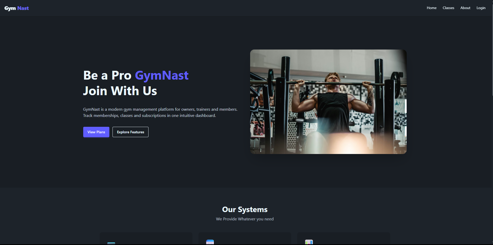
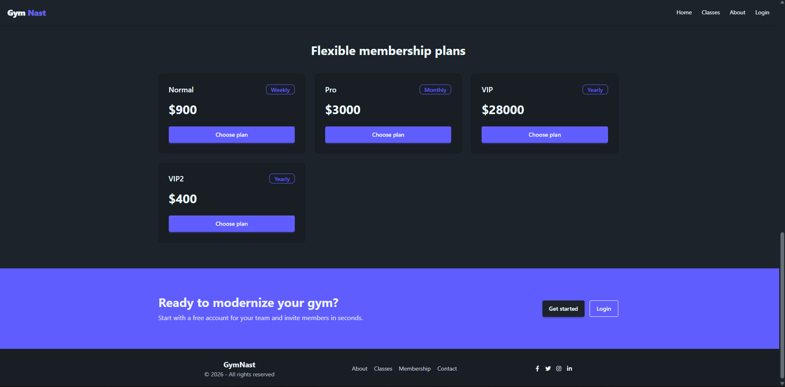
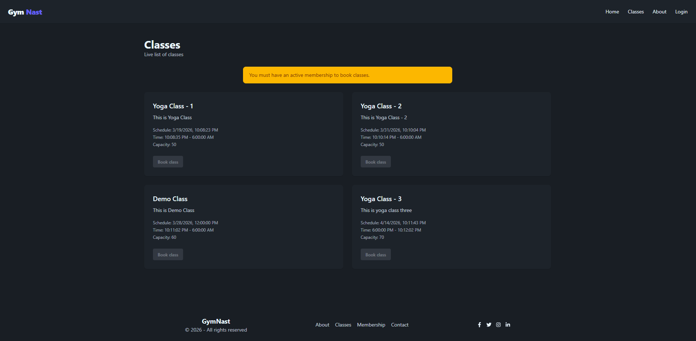

# GymNast

GymNast is a modern gym management platform that helps gym owners, trainers, and members manage memberships, classes, subscriptions, and more from a single, easy-to-use interface.

---

## Features

- **Membership Management:** Create and manage membership plans, track subscriptions, and payments.
- **Class Scheduling:** Manage gym classes, trainers, and participant lists.
- **Member Portal:** Let members track their subscriptions, join classes, and manage profiles.
- **Real-time Dashboard:** Get insights into revenue, active members, and upcoming classes.
- **Responsive Frontend:** Built with React, Tailwind CSS, and DaisyUI.
- **API Powered:** Fully powered by GymNast Ecommerce API (Django REST Framework).

---

## Tech Stack

- **Frontend:** React, React Router v6, Tailwind CSS, DaisyUI, Axios
- **Backend:** Django, Django REST Framework
- **Database:** PostgreSQL / MySQL
- **Authentication:** JWT / Django Auth
- **Deployment:** Vite (frontend), Django (backend)

---

## Screenshots





---

## Getting Started

### Prerequisites

- Node.js >= 18.x
- npm >= 9.x or yarn
- Python >= 3.11
- Django >= 5.2

---

### Frontend Setup

```bash
cd frontend
npm install
npm run dev
```
## License

MIT License © 2026 Mubtasim Ahsan Taha

---

## Developer

**Mubtasim Ahsan Taha**
- Full Stack Developer 
- Lead Developer — GymNast

- Email: mubtasimtaha@gmail.com

